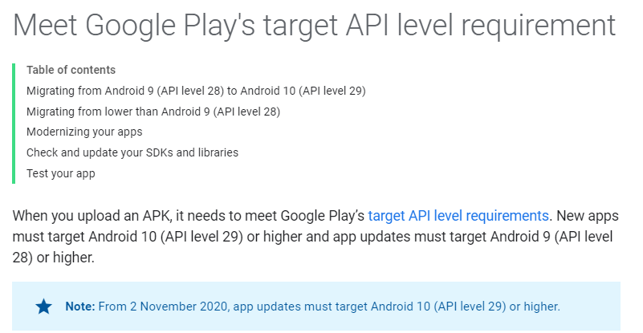
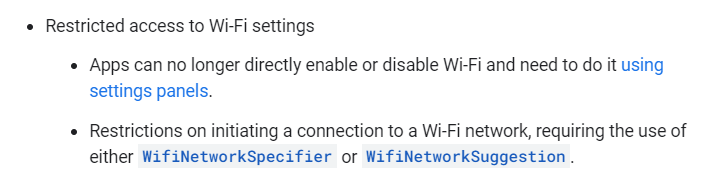
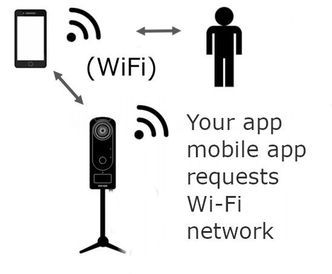

# RICOH THETA Wi-Fi API October Community Update

_Last updated October 21, 2020_

This is a community document based on contributions of
informal test results 
from the [theta360.guide independent community](https://www2.theta360.guide/).  This is
not an official RICOH document.  For official information, please
contact RICOH. You should confirm these community tips with your
own tests prior to deployment in a business setting. As these are
unofficial tips, the official RICOH THETA API may change unexpectedly
and these techniques could stop working. 


## Problem Description and Fixes

For Android mobile applications targeting API 29, the Wi-Fi hotspot connection functions are deprecated.
When using the `NetworkSpecifier` function, API calls to the RICOH THETA fail.

## Credit and Thanks

[Problem](https://community.theta360.guide/t/solved-ricoh-theta-connection-issue-using-android-api-29/6127?u=craig) and [solution](https://community.theta360.guide/t/solved-ricoh-theta-connection-issue-using-android-api-29/6127/6?u=craig) were reported by [saleh](https://community.theta360.guide/u/saleh/summary). Thank you!

## Changes to Google Play Store Requirements

New Android apps must target Android 10, API level 29.  From November 2, 2020, app updates will also need
to target API level 29. Read [more](https://developer.android.com/distribute/best-practices/develop/target-sdk) on the Android developer site. 



## Potential Impact on THETA Developers

If your THETA app uses `WifiNetworkSpecifier` or `WifiNetworkSuggestion` when your customers' mobile phones connect to RICOH THETA cameras in Wi-Fi in Access Point (AP) mode, you may need to adjust your application.



Problem is apparent if your app reduces the Wi-Fi setup steps to enhance the experience for your staff or customers.



## Example Problem

```java

final WifiNetworkSpecifier specifier = new WifiNetworkSpecifier.Builder()
   //.setSsidPattern(new PatternMatcher(ssid, PatternMatcher.PATTERN_PREFIX))
     .setSsid(ssid)
     .setWpa2Passphrase(passPhrase)
     .setBssid(MacAddress.fromString(i.BSSID))
     .build();
     
final NetworkRequest request = new NetworkRequest.Builder()
    .addTransportType(NetworkCapabilities.TRANSPORT_WIFI)
    .removeCapability(NetworkCapabilities.NET_CAPABILITY_INTERNET)
    .setNetworkSpecifier(specifier)
    .build();

final ConnectivityManager connectivityManager = (ConnectivityManager) context.getSystemService(Context.CONNECTIVITY_SERVICE);

final ConnectivityManager.NetworkCallback networkCallback = new ConnectivityManager.NetworkCallback() {
            @Override
            public void onAvailable(@NonNull android.net.Network network) {super.onAvailable(network);}
            @Override
            public void onUnavailable() { super.onUnavailable();}
            @Override
            public void onLost(@NonNull android.net.Network network) { super.onLost(network);}
        };
//connectivityManager.registerNetworkCallback(request, networkCallback);
connectivityManager.requestNetwork(request, networkCallback);
```

### Error

`GET http://192.168.1.1/osc/info` request will fail.

Error Message:

```
Caused by: java.net.ConnectException: 
failed to connect to /192.168.1.1 (port 80) from /:: 
(port 0) after 10000ms: 
connect failed: ENETUNREACH (Network is unreachable)
```

## Workaround

Bind the THETA camera for all outgoing traffic. [Solution](https://community.theta360.guide/t/solved-ricoh-theta-connection-issue-using-android-api-29/6127/6?u=craig) from saleh.

```java
    private ConnectivityManager.NetworkCallback networkCallback = new ConnectivityManager.NetworkCallback() {

    @Override
    public void onAvailable(@NonNull android.net.Network network) {
        super.onAvailable(network);
        connectivityManager.bindProcessToNetwork(network);
        Timber.d("++++++ network connected - %s", network.toString());
    }};
```


---
This tip and many more SC2 developer articles are available on the 
[SC2 Developers Community Site](https://theta360.guide/special/sc2/).
Markdown to PDF conversion done with [Grip](https://github.com/joeyespo/grip). 

__This is not an official RICOH document. It is produced by
an independent community. Please contact RICOH for official
information.__ 
